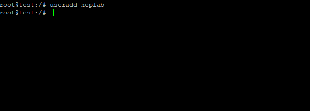
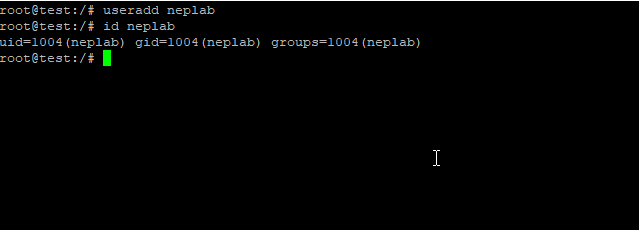
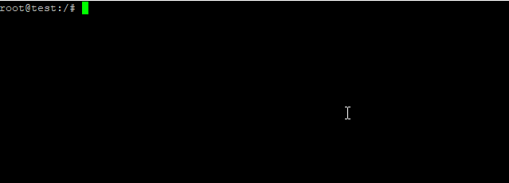
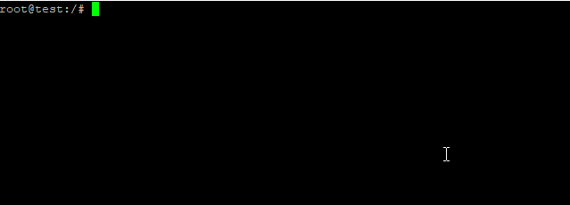

[](https://neplearn.com)

# User Management

## Theory
We'll practice users and groups in this chapter. Please follow instructions for this lab.

## Instructions

### useradd
*add new user* <br>
**syntax**

> useradd *name_of_the_user*

```bash
useradd neplab
```


### id
*check the id of user* <br>
**syntax**

> id *name_of_the_user*

```bash
id neplab
```


### passwd
*setting password for user* <br>
**syntax**

> passwd *name_of_the_user*

```bash
passwd neplab
```


### groupadd
*add new group* <br>
**syntax**

> groupadd *name_of_the_group*

```bash
groupadd nepal
groupadd ktm
```


### usermod -g
*change primary group to user* <br>
**syntax**

> usermod -g *name_of_the_group* *name_of_the_user*

```bash
usermod -g nepal neplab
```


### usermod -G
*change secondary groups to user* <br>
**syntax**

> usermod -G *name_of_the_group(s)* *name_of_the_user*

```bash
usermod -G ktm neplab
```


## Are you Done?
- [ ] id <name of the user> displays primary group and secondary groups.
#
**Previous:** [Variables](https://github.com/neplearn/lab_linux/tree/master/lab_07Variables)
#
**Next:** [File Management](https://github.com/neplearn/lab_linux/tree/master/lab_09File_Management)

## Author
Neplearn

## Visit us
[Neplearn Page](https://www.neplearn.com)

## Brace yourself, Users are coming
