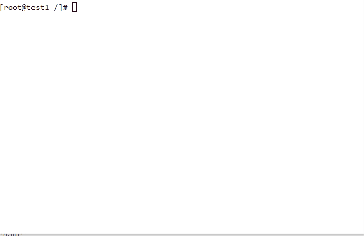

[](https://neplearn.com)

# Service Management

## Theory
Linux comes with several default services. You can run these service for one time or enable them to run after boot
everytime. Services runs on sepcific ports. For example, sshd service runs on 22 port due to which we can login into
the box.

## Instructions

**list out running services**

> systemctl list-units --type service

```bash
systemctl list-units --type service
```


**start service**

> systemctl start 'servicename'.service

```bash
systemctl start httpd.service
```


**stop service**

> systemctl stop 'servicename'.service

```bash
systemctl stop httpd.service
```


**run service after boot**

> systemctl enable 'servicename'

```bash
systemctl enable http
```


**stop service after boot**

> systemctl enable 'servicename'

```bash
systemctl disable http
```


## Are you Done?
- [ ] Services are easy, check status; then either start it or stop it. I know both. 
#
**Previous:** [Package Management](https://github.com/neplearn/lab_linux/tree/master/lab_10Package_Management)
#
**Next:** [Data Management](https://github.com/neplearn/lab_linux/tree/master/lab_12Data_Management)
#
## Author
Neplearn

## Visit us
[Neplearn Page](https://www.neplearn.com)

## Server provide services :computer:
