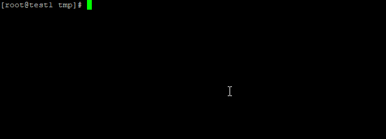
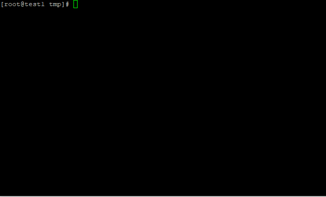
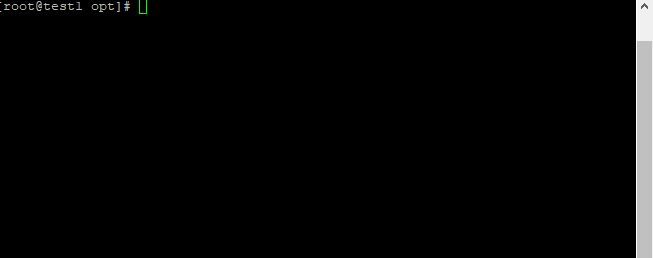
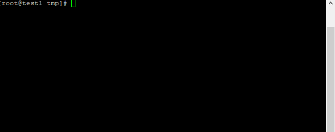
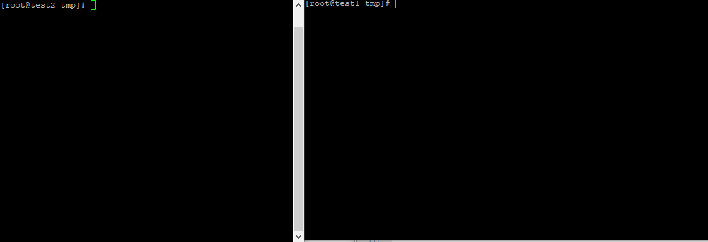
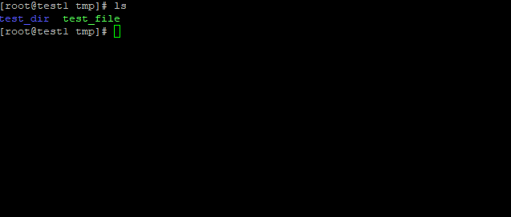

[](https://neplearn.com)

# File management

## Theory
In this lab, we'll manage files and directories within linux.

## Instructions

### create new file
*file can be created several different ways. For now, we'll start with touch* <br>
**syntax**

> touch *name_of_the_file*

```bash
touch test_file
```


### create new dir
*dir can be created with 'mkdir' command* <br>
**syntax**

> mkdir *name_of_the_dir*

```bash
mkdir test_dir
```


### edit file
*file can be edited with or without editor but for this lab, we'll learn how to use vi/vim* <br>
**syntax**

> vim *name of the file*

```bash
vi test_file
```

#### vim modes
As soon as you enter inside editor, you are in command mode <br>

**command mode** = This is the vi mode where you can enter commands. Such as:

i = to go to insert mode <br>
:q! = to quit <br>
:wq! = to save and quit <br>

**insert mode** = This the mode where you'd actually write. Like mention above press "i" to enter insert mode
and "Esc" to get out of insert mode into command mode.

**syntax**

> vim *name of the file*

```bash
vim test_file
```


### view file
*file can be created several different ways. We'll start with 'cat' command* <br>
**syntax**

> cat *name_of_the_file*

```bash
cat test_file
```


### user group owner
Let's create a file, /opt/test_file and let's set user owner and group owner for it.
**syntax**

> chown user_owner:group_owner *name_of_the_file*

```bash
touch /opt/test_file
chown neplab:nepal /opt/test_file
```


### file permission
*file permmission can be set using numbers* <br>
(r)read = 4 <br>
(w)write = 2 <br>
(x)execute = 1 <br>

* File permission can be set in 3 slots. <br> 
	_ _ _ <br> <br>
  
  First one - User owner <br>
  Second one - Group Owner <br>
  Third one - Others <br>

**syntax**

> chmod --- *name of the file*

```bash
chmod 750 test_file
```

In this example, user owner gets 7 (r+w+x), group owner gets 5 (r+x) and Others have none.

### copy file/dir
* You can copy the file/dir using cp command*
**syntax**

> cp *source* *destination*
> cp -R *source* *destination*

```bash
cp /tmp/test_file /opt
```


### copy file 'from' and 'to' remote dir
*You can use following syntax to copy file from local to remote server or other way around*
**syntax**

> scp *source* *destination*

Copy from remote to local server 

```bash
scp user@<ip or hostname>:/remote/location /local/location
```


### move/rename file/dir
*You can use 'mv' command to either move or rename file/dir* <br> <br>
**rename syntax**

> mv *filename* *new_filename*

```bash
mv test_file new_test_file
```


**move syntax**

> mv *path_of_filename* *new_path_of_filename*

```bash
mv /tmp/test_file /opt/
```


### remove file/dir
*You can use 'rm' command to delete file/dir*
**syntax**

> rm -rf *file/dir*

```bash
rm -rf test_file
```


## Are you Done?
- [ ] I can set the permission for dir and sub-dir
- [ ] I can copy dir and sub dir at same time
- [ ] I can rename file
- [ ] I can copy file from local to remote server
- [ ] I understand the parameters '-rf' for rm command
#
**Previous:** [User Management](https://github.com/neplearn/lab_linux/tree/master/lab_08User_Management)
#
**Next:** [Package Management](https://github.com/neplearn/lab_linux/tree/master/lab_10Package_Management)
#
## Author
Neplearn

## Visit us
[Neplearn Page](https://www.neplearn.com)

## User Permissions or Magic Numbers !
