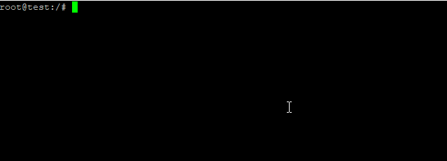

[](https://neplearn.com)

# Variables

## Theory
variable is representation of actual data. We assign value to a specific variable so we can use it during runtime.
Variable is denoted by $ in bash shell. <br>

In this lab, we are assigning value to a variable and display it. For example, let's assign

*variable* hello to *string* "Hello World"

<br>

### Assigning a Value

**syntax**

> export 'name of the variable'='assigned value'

```bash
export hello="Hello World"
```


### Displaying a Variable

**syntax**

> echo $'name of the variable'

```bash
echo $hello
```



## Instructions

- Try setting up a variable permanently for single user shell.
- Try setting up a variable permanently for global user shell.

## Are you Done?

- [ ] I can Set and Display variable
#
**Previous:** [Help](https://github.com/neplearn/lab_linux/tree/master/lab_06Help)
#
**Next:** [User Management](https://github.com/neplearn/lab_linux/tree/master/lab_08User_Management)
#
## Author
Neplearn

## Visit us
[Neplearn Page](https://www.neplearn.com)

## Not sure if that's a variable or 'variable'
